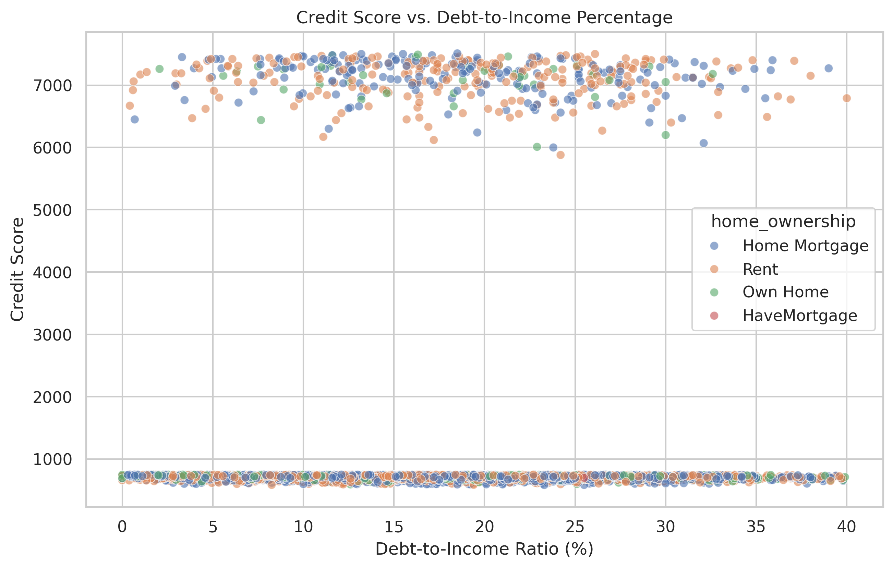
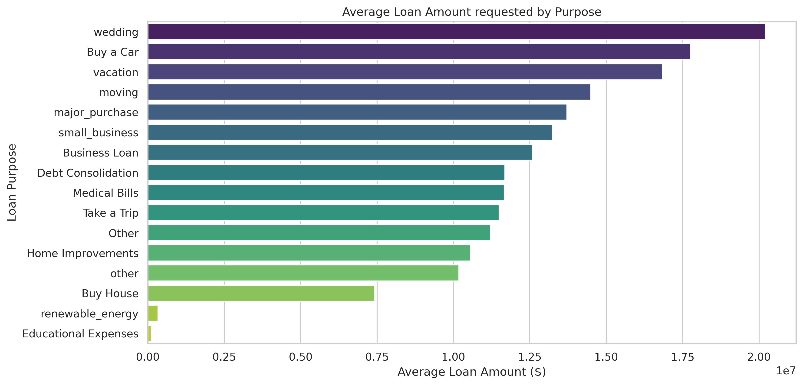

# Loan Portfolio Risk Analysis Dashboard
This project is designed to evaluate financial risk within a loan portfolio. It transforms raw financial data into a structured relational database, performs Exploratory Data Analysis (EDA) to uncover risk indicators, and culminates in a fully interactive Power BI dashboard for dynamic portfolio monitoring.

## Tech Stack
* **Database Management:** SQLite (Relational Schema Design, Views, Data Imputation)
* **Exploratory Data Analysis:** Python (Pandas, Matplotlib, Seaborn)
* **Data Visualization:** Microsoft Power BI (DAX, Interactive Filtering, Power Query)

---

## Data Engineering & Database Schema
To ensure data integrity and optimize query performance, the raw dataset was normalized into a 3rd Normal Form (3NF) SQLite database consisting of three core tables:

1. **`customers`**: Contains static demographic data (`customer_id`, `annual_income`, `home_ownership`, `years_in_current`).
2. **`loans`**: Contains specific loan terms (`loan_id`, `customer_id`, `current_loan_amo`, `purpose`, `monthly_debt`).
3. **`credit_profiles`**: Tracks borrower risk history (`loan_id`, `credit_score`, `number_of_credit_problems`).

A unified view (`dashboard_data`) was created using SQL `JOIN`s to calculate dynamic metrics (like Debt-to-Income percentage) and feed clean, denormalized data directly to the Python scripts and Power BI.

---

## Exploratory Data Analysis (Python)
Before building the dashboard, Python was used to establish statistical baselines and identify high-level trends. 

### 1. Risk vs. Debt-to-Income (DTI)
*(This scatter plot analyzes the correlation between a borrower's debt burden and their credit score.)*
 

### 2. Loan Volume by Purpose
*(This chart breaks down the average loan amount requested based on the stated purpose of the loan.)*
 

---

## Interactive Dashboard (PowerBI)
Built the Interactive Dashboard in PowerBI to visualize the relation between data.

### Interactive Dashboard DEMO
Demo GIF showing the working of Dashboard, named "dashboard_demo.gif" in the main branch.
